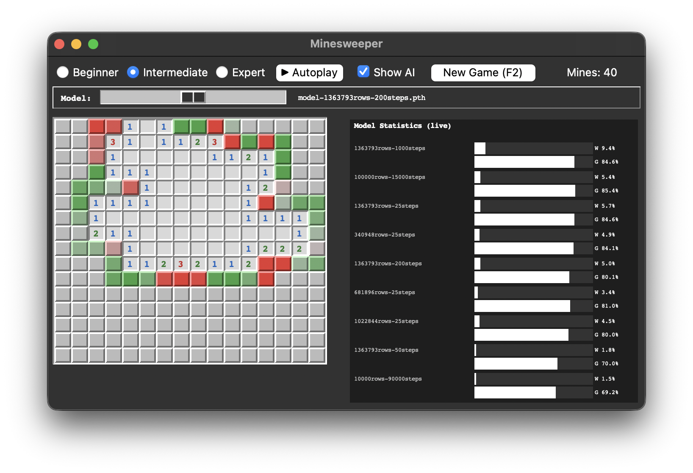

# minesweeper-bot

Minesweeper AI bot

Dataset : https://www.kaggle.com/datasets/michelechierchia/dataset-minesweeper-game/data

Place `minesweeper_dataset.csv` in `/data/`

Create a .env file with the following variables:

```
DB_USERNAME=username
DB_PASSWORD=password
DB_HOST=host.name
DB_PORT=port#
DB_NAME=dbname
DB_SCHEMA=dbschema
```

Run `database-setup.py` to setup the database tables.

```
python3 database-setup.py
```

Run `train-model.py` to train a model.

```
python3 train-model.py
```

Run `benchmark-model.py` to benchmark a model.

```
python3 benchmark-model.py
```

Run `analyze.py` to analyze the dataset and models.

```
python3 analyze.py
```

Run `minesweeper_ai_db.py` to run the GUI.

```
cd game
python3 minesweeper_ai_db.py
```


